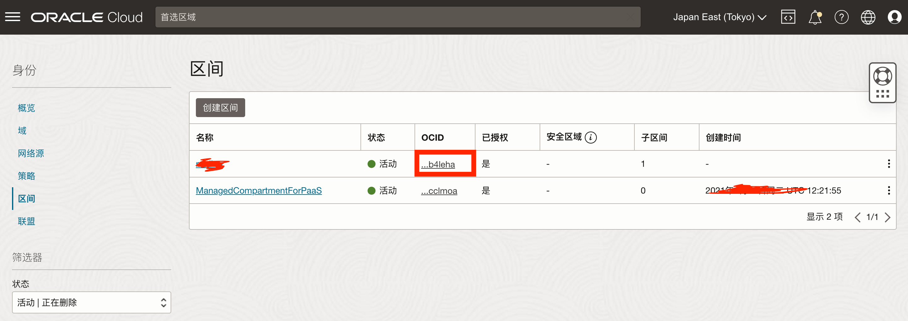

# Oracle Cloud Always Free 服务器状态监控
### 本项目建议有一定编程经验者使用
忘了从何时开始，甲骨云开始会不定时周期性的把不长具有活跃性的服务器关停。

**本项目主要监控服务器运行状态，在甲骨文云关停时，自动通过oci进行启动。**

## 使用步骤：
找寻以下几个变量
1. REGION

截止2024年02月19日，甲骨文云一共有如下[可用region](./resource/region.txt)，请结合

自行找到自己所对应的REGION，KEY或NAME都可以
2. COMPARTMENT

打开[https://cloud.oracle.com/identity/compartments](https://cloud.oracle.com/identity/compartments)，找到除开ManagedCompartmentForPaaS的另一个实际租户的ocid填入

3. fingerprint及private_key

打开[https://cloud.oracle.com/identity/domains/my-profile/api-keys](https://cloud.oracle.com/identity/domains/my-profile/api-keys)，创建一个API密钥
然后将保存的私钥文件的内容填入，并记录下指纹下步会使用

4. USER
打开[https://cloud.oracle.com/identity/domains/my-profile](https://cloud.oracle.com/identity/domains/my-profile)复制用户信息中的ocid替换

按照accounts.json的示例格式把相关变量替换，特别是`private_key`需要base64编码
完成后再把整个accounts.json文件base64编码后填入OCI_ACCOUNTS

